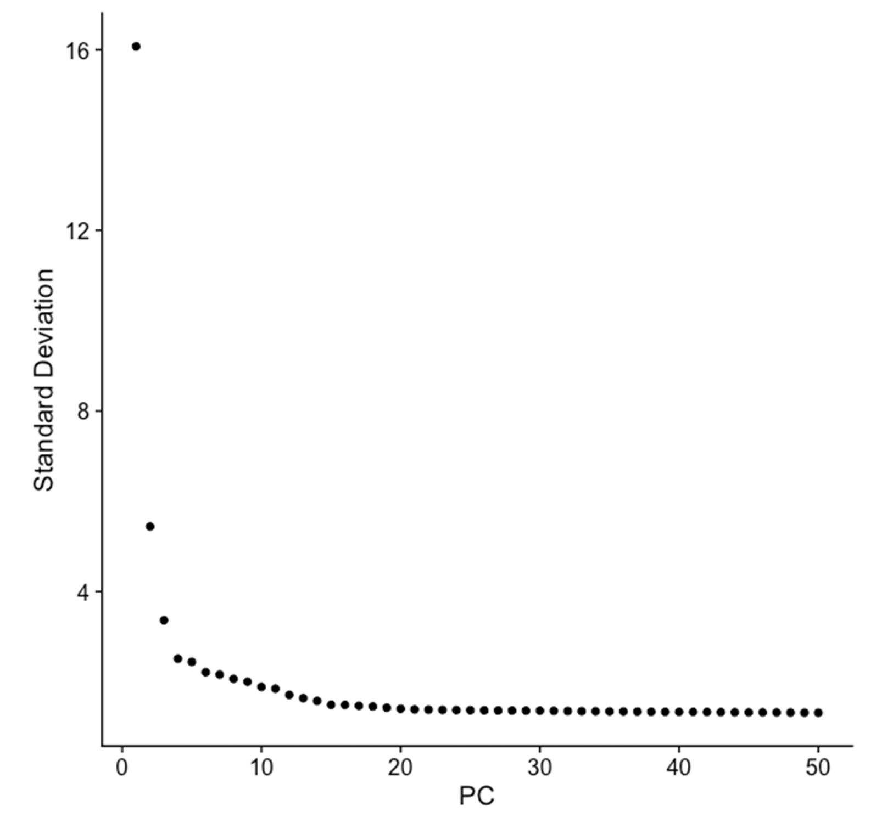
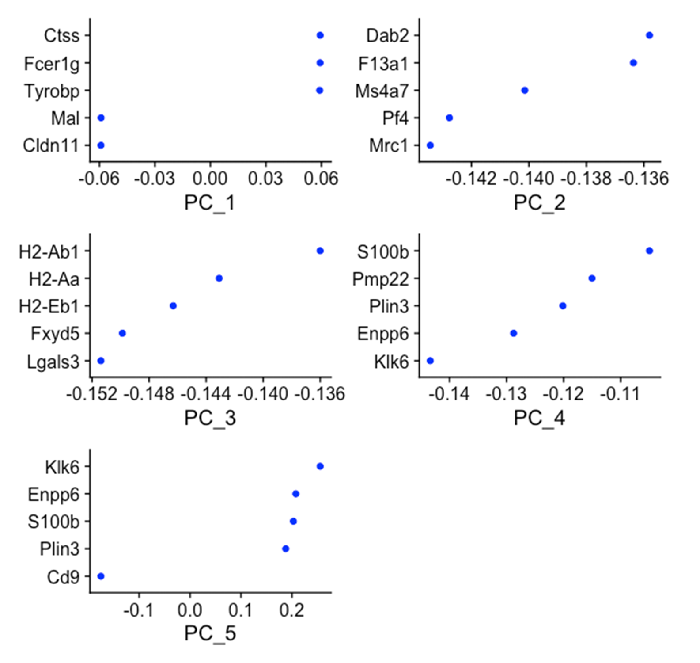
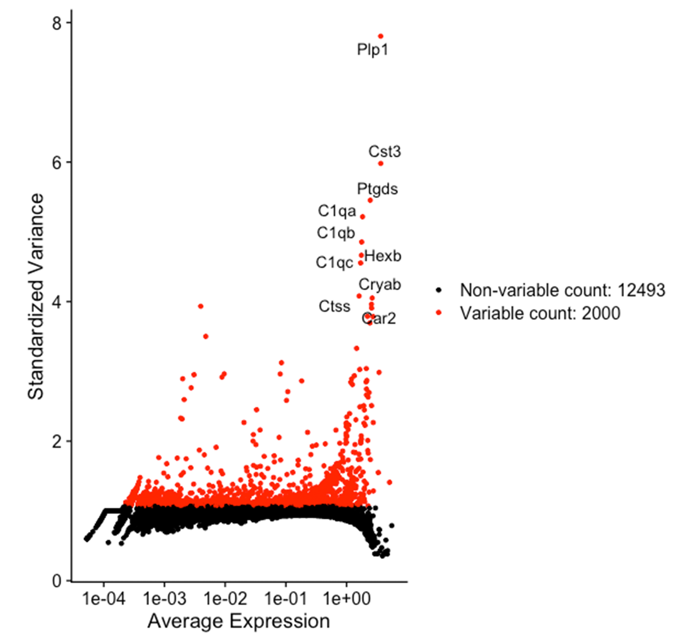
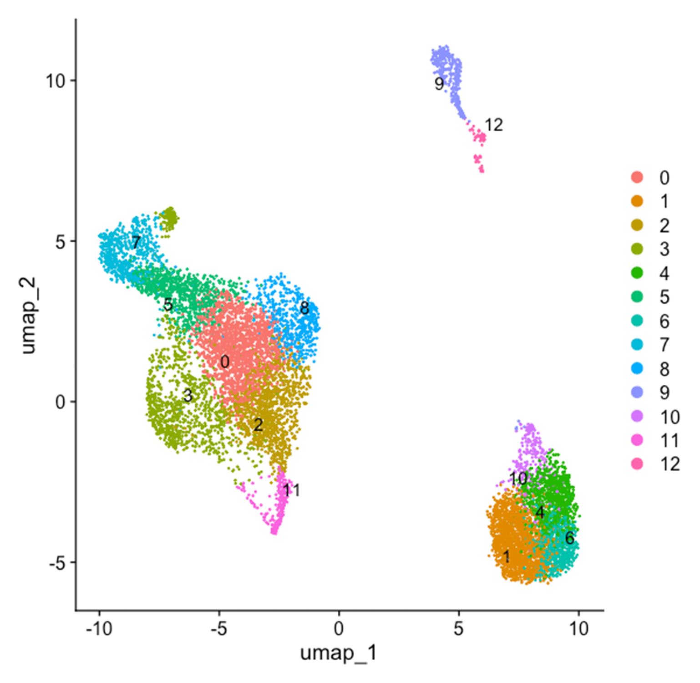
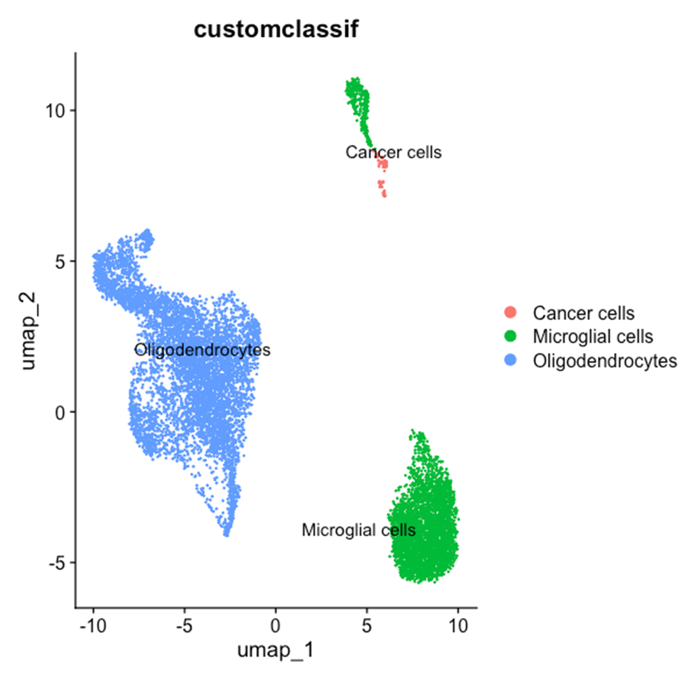

# scMilvus
Milvus implementation for scRNA-seq data

# Purpose
Here, we implement the vector database Milvus as a means for storing and retreiving single cell RNA sequencing (scRNAseq) data. scRNAseq datasets are large and complex. They require specialized processing to extract gene expression information and patterns from individual cells to understand cell states and lineages. In standard scRNAseq analysis, distance metrics, such as Euclidean and cosine similarity are used to cluster like cell types. From these clusters, gene expression, compared against reference datasets, allow for probabilistic identification of cell types. 

Vector databases (VDBs) are specialized databases that utilize high-dimensional vectors as the primary data structure for storing information [1]. In VDBs, data points are represented as multidimensional vectors, where each dimension corresponds to a specific attribute or feature of the data. These vectors can contain various types of numerical data, including integers and floating-point numbers, depending on the nature of the data being stored. In contrast to traditional relational database models that search columns and rows, VDBs perform similarity searches on data points using distance metrics such as Euclidean distance, dot product, or cosine similarity [2].

Given the hyperdimensional nature of scRNA-seq data and the multidimensional capabilities of VDBs, marrying the two could prove to enhance scRNA-seq data storage, processing, and manipulation. By querying cell similarity straight from the VDB, multiple similar experiments could be queried for cell state similarity/cell type. This could open up possibilities for experimental archive that allows for fast approximation of cell populations across experiments and treatment groups.

[1] Yikun Han, Chunjiang Liu, and Pengfei Wang. A Comprehensive Survey on Vector Database:
Storage and Retrieval Technique, Challenge. Preprint. 2023. arXiv: 2310.11703 [cs.DB].

[12] Toni Taipalus. “Vector database management systems: Fundamental concepts, use-cases, and
current challenges”. In: Cognitive Systems Research 85 (June 2024), p. 101216. issn: 1389-0417.
doi: 10.1016/j.cogsys.2024.101216. url: http://dx.doi.org/10.1016/j.cogsys.2024.
101216.

# Basic Functionality
## R in R studio
### Matrix_Builder_Normalized_CellClean.qmd
- Create a Seurat object in R from a dataframe containing genes (m) and individual cells (n) from scRNAseq experiment
- Scale and center the data to normalize gene expressions
- Filter out non-viable cells based on gene counts/expression
### scRNAseq_Analysis_Pipeline.qmd
- Perform Principal Components Analysis (PCA) for dimensionality reduction, reataining the most significant components
- Peform neraest neighbor and clustering to identify like cells from gene expression using distance metrics (i.e. Euclidean distance, cosine similarity)
- Plot the 2-Dimensional UMAP for visualization
- Extract cells from those clusters for comparison to Milvus vector similarity search
- Use scType to predict the cell types in each cluster
## Python
### Analysis.py
- Identify clusters of similar cells starting from seed cell IDs and iteratively expands the search
- Processes similarity data and saves the results to CSV files
- Find the original gene data for each cell in the top-n similar cells
-  Map the cell_ids to a cell_name from the respective experiment
-   Return a dictionary with the keys [cell_id, cell_name, top_genes] were cell_id and cell_name are from the vectors in Milvus and p_genes is a list of the top_n genes expressed in each cell, ordered most to least expressed.
        

# Figures

## Elbow plot of PC significance
  

## Differential gene expression by PC

## Scatter plot of most variably expressed genes across all cells

## Cell clusters based on gene expression using Uniform Manifold Approximation (UMAP) in Seurat

## Cell type prediciton for clusters using scType library

